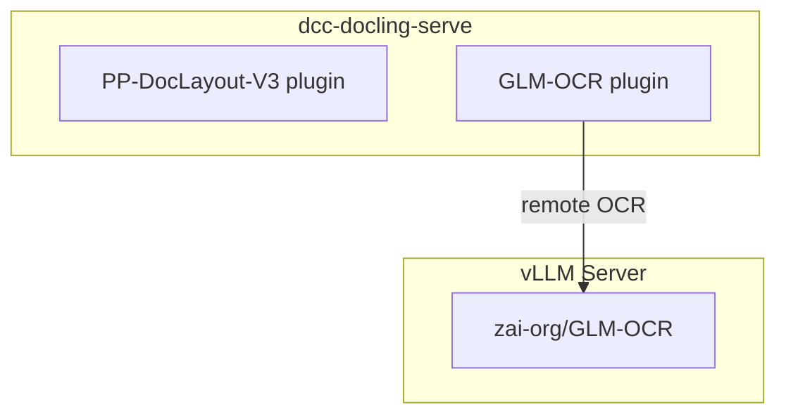

# Docling-Serve Plugins: PP-DocLayout-V3 + GLM-OCR

[](https://github.com/DCC-BS/dcc-docling-serve/actions/workflows/ci.yml)

A patched [docling-serve](https://github.com/docling-project/docling-serve) Docker
image that bundles two community plugins:

## Available images

| Image | Based on | Architectures | Notes |
| --- | --- | --- | --- |
| `ghcr.io/dcc-bs/dcc-docling-serve` | `docling-serve` | linux/amd64 | Base image, packages from PyPI (torch with CUDA 13) |
| `ghcr.io/dcc-bs/dcc-docling-serve-cpu` | `docling-serve-cpu` | linux/amd64, linux/arm64 | CPU-only, torch from PyTorch CPU index |
| `ghcr.io/dcc-bs/dcc-docling-serve-cu128` | `docling-serve-cu128` | linux/amd64 | CUDA 12.8, torch from cu128 index |
| `ghcr.io/dcc-bs/dcc-docling-serve-cu130` | `docling-serve-cu130` | linux/amd64 | CUDA 13.0, torch from cu130 index |

Each image is tagged with the upstream docling-serve version (e.g. `v2.3.0`) and `:latest`.

## Plugins

| Plugin | PyPI | Purpose |
| --- | --- | --- |
| [docling-glm-ocr](https://github.com/DCC-BS/docling-glm-ocr) | `pip install docling-glm-ocr` | Remote OCR via a vLLM-hosted GLM-OCR model |
| [docling-pp-doc-layout](https://github.com/DCC-BS/docling-pp-doc-layout) | `pip install docling-pp-doc-layout` | Local layout detection via PP-DocLayout-V3 |

The plugins are selectable per-request through the standard docling-serve API:

- **Layout** -- `layout_preset: "ppdoclayout-v3"` (preset defined in `compose.yaml`) or
  `layout_custom_config: { "kind": "ppdoclayout-v3" }`
- **OCR** -- `ocr_preset: "glm-ocr-remote"`

The docling-serve web UI at `/ui` is upstream's, unchanged. It lists both plugins
among its OCR and layout choices.

## Architecture



## Quickstart

### 1) Prerequisites

- Docker with GPU support (NVIDIA)
- A HuggingFace token with access to the GLM-OCR model

### 2) Configure

Copy `.env.example` to `.env` and set the required variables:

```bash
cp .env.example .env
# edit .env — at minimum set HF_TOKEN
```

| Variable | Description | Default |
| --- | --- | --- |
| `HF_TOKEN` | HuggingFace token for downloading GLM-OCR (required) | — |
| `HF_CACHE_DIR` | Host directory for the HF model cache | `.hf-cache` |
| `VLLM_HOST_PORT` | Host port for the vLLM server | `8001` |
| `DOCLING_HOST_PORT` | Host port for docling-serve | `5001` |
| `DOCLING_SERVE_TAG` | Upstream docling-serve image tag | `latest` |
| `DOCLING_SERVE_LOG_LEVEL` | Log level for docling-serve | `INFO` |

### 3) Start the stack

```bash
make docker-up
```

This starts two services:

| Service | Purpose |
| --- | --- |
| **vllm-glm-ocr** | vLLM server hosting `zai-org/GLM-OCR` (GPU 1) |
| **docling-serve** | Docling API + web UI with both plugins (GPU 0) |

The web UI is available at http://localhost:5001/ui.

### 4) Convert a document

Remote GLM-OCR OCR with PP-DocLayout-V3 layout:

```bash
curl -X POST http://localhost:5001/v1/convert/source \
  -H 'Content-Type: application/json' \
  -d '{
    "options": {
      "ocr_engine": "glm-ocr-remote",
      "layout_custom_config": { "kind": "ppdoclayout-v3" }
    },
    "sources": [{"kind": "http", "url": "https://arxiv.org/pdf/2501.17887"}]
  }'
```

## Docker Compose

The `compose.yaml` references the pre-built image from GHCR:

```
ghcr.io/dcc-bs/dcc-docling-serve:latest
```

| Service | Image |
| --- | --- |
| **vllm-glm-ocr** | `vllm/vllm-openai:v0.29.0` |
| **docling-serve** | `ghcr.io/dcc-bs/dcc-docling-serve:latest` |

Environment variables are documented in `.env.example`.

```bash
make docker-up    # start all services
make docker-down  # stop all services
```

### Building the image locally

To build the patched docling-serve image from source:

```bash
make docker-build
```

This runs `docker build` against `plugins/Dockerfile.docling-serve` (default upstream
image, `latest` tag) and tags the result as `$DOCLING_IMAGE`
(default `ghcr.io/dcc-bs/dcc-docling-serve:latest`).

#### Running the locally built image

To test the local image without pushing it to GHCR, run `docling-serve` directly
with `docker run`:

```bash
docker run --add-host=host.docker.internal:host-gateway --rm \
  --gpus device=0 \
  -p 5001:5001 \
  -e DOCLING_SERVE_ENABLE_UI=true \
  -e DOCLING_SERVE_ENABLE_REMOTE_SERVICES=true \
  -e DOCLING_SERVE_ALLOW_EXTERNAL_PLUGINS=true \
  -e GLMOCR_REMOTE_OCR_API_URL=http://host.docker.internal:8001/v1/chat/completions \
  ghcr.io/dcc-bs/dcc-docling-serve:latest
```

The web UI is then available at http://localhost:5001/ui.

Because `make docker-build` tags the image with the name `compose.yaml` uses, the
normal compose flow picks up the local build:

```bash
make docker-build
make docker-up
```

## Plugin configuration

All plugins are fully configurable via environment variables, making them
suitable for zero-code deployment in Docker / Compose environments.
Explicit `GlmOcrRemoteOptions` and `PPDocLayoutV3Options` constructor arguments
always take precedence when using the Python SDK directly.

### GLM-OCR remote OCR — environment variables

| Variable | Description | Default |
| --- | --- | --- |
| `GLMOCR_REMOTE_OCR_API_URL` | vLLM chat completion URL | `http://localhost:8001/v1/chat/completions` |
| `GLMOCR_REMOTE_OCR_MODEL_NAME` | Model name sent to vLLM | `zai-org/GLM-OCR` |
| `GLMOCR_REMOTE_OCR_PROMPT` | Text prompt sent with each image crop | built-in default |
| `GLMOCR_REMOTE_OCR_TIMEOUT` | HTTP timeout per crop (seconds) | `120` |
| `GLMOCR_REMOTE_OCR_MAX_TOKENS` | Max tokens per completion | `16384` |
| `GLMOCR_REMOTE_OCR_SCALE` | Image crop rendering scale | `3.0` |
| `GLMOCR_REMOTE_OCR_MAX_IMAGE_PIXELS` | Pixel budget per crop | `4500000` |
| `GLMOCR_REMOTE_OCR_MAX_CONCURRENT_REQUESTS` | Max concurrent API requests | `10` |
| `GLMOCR_REMOTE_OCR_MAX_RETRIES` | Max retry attempts for HTTP errors | `3` |
| `GLMOCR_REMOTE_OCR_RETRY_BACKOFF_FACTOR` | Exponential backoff factor for retries | `2.0` |
| `GLMOCR_REMOTE_OCR_LANG` | Comma-separated language hint(s) | `en` |
| `GLMOCR_REMOTE_OCR_API_KEY` | Bearer token for `Authorization` header | unset (no header sent) |

### PP-DocLayout-V3 layout — environment variables

| Variable | Description | Default |
| --- | --- | --- |
| `PP_DOC_LAYOUT_MODEL_NAME` | HuggingFace model repo ID | `PaddlePaddle/PP-DocLayoutV3_safetensors` |
| `PP_DOC_LAYOUT_CONFIDENCE_THRESHOLD` | Minimum detection confidence (0.0–1.0) | `0.5` (`compose.yaml` sets `0.3`) |
| `PP_DOC_LAYOUT_BATCH_SIZE` | Batch size for layout inference | `8` |
| `PP_DOC_LAYOUT_CREATE_ORPHAN_CLUSTERS` | Create clusters for orphaned elements (`true`/`false`) | `true` |
| `PP_DOC_LAYOUT_KEEP_EMPTY_CLUSTERS` | Retain empty clusters in results (`true`/`false`) | `false` |
| `PP_DOC_LAYOUT_SKIP_CELL_ASSIGNMENT` | Skip table-cell assignment (`true`/`false`) | `false` |

Boolean variables accept `true`, `1`, `yes` (case-insensitive) as truthy; anything else is `false`.

`compose.yaml` lowers `PP_DOC_LAYOUT_CONFIDENCE_THRESHOLD` to `0.3`. docling only OCRs inside
layout regions, and PP-DocLayout-V3 (trained on document pages) detects handwriting on phone
photos with only 0.3–0.4 confidence. At `0.5` most of the handwritten list on the test photo got
no region and was never read. At `0.3` over all 28 test documents: photo handwriting 11 % → 44 % with
RapidOCR and 22 % → 89 % with GLM-OCR, headings on the synthetic documents 0.85 → 0.96, born-digital
text unchanged. The catch: GLM-OCR also gets low-confidence regions on text-free photos and can
invent text there (on one photo page it repeated "Wiesbaden" 483 times); RapidOCR does not. See the
engine dashboard for the full comparison.

### SDK option reference

All environment variables above correspond to fields on `GlmOcrRemoteOptions` and `PPDocLayoutV3Options`. See the individual plugin READMEs for the full option reference:

- [`docling-glm-ocr` README](https://github.com/DCC-BS/docling-glm-ocr#configuration)
- [`docling-pp-doc-layout` README](https://github.com/DCC-BS/docling-pp-doc-layout#configuration-options)

## RapidOCR on the GPU

The upstream CUDA images ship the CPU-only `onnxruntime`, so RapidOCR (the default
OCR engine, onnxruntime backend) runs on the CPU even on a GPU and dominates the
processing time. `plugins/install_onnxruntime_gpu.sh` fixes this at build time for
every image whose torch has CUDA support. CPU images are left unchanged.

- It replaces `onnxruntime` with the matching `onnxruntime-gpu`: PyPI for CUDA 13
  (same version as upstream), the onnxruntime CUDA 12 feed for CUDA 12.
- It registers the CUDA/cuDNN libraries of the `nvidia-*` wheels with `ldconfig`,
  so the CUDA provider loads regardless of whether torch was imported first.
- The build fails if `CUDAExecutionProvider` is missing or its libraries do not resolve.

No request option is needed. docling already enables CUDA for RapidOCR when the
accelerator device is CUDA, which it is by default when a GPU is visible.

## OCR: vector shapes no longer trigger OCR

**Problem.** Since docling 2.121 the default OCR mode (`pdf_aware_layout_regions`) sends a
layout region to OCR when it overlaps a bitmap *or a vector shape*, even if the region
already has PDF text. Table rules, underlines and background fills are shapes, so on
born-digital documents almost every region is OCR'd. A financial statement with a
full-page background, for example, is OCR'd completely although all 172 text cells are
real text. docling then keeps the PDF text wherever both exist, so this OCR is thrown
away. There is no request option to change it.

**Evidence** (docling-serve 1.35.0, RTX 4090, 27 test documents / 976 pages, see
[Converter comparison](#converter-comparison)):

| | OCR rule as upstream | Shapes ignored |
|---|---:|---:|
| Conversion time, all documents | 522 s | 165 s |
| CELEX regulation, 603 pages | 367 s | 88 s |
| Markdown identical to upstream | – | 22 of 27 documents, rest ≥ 97.7 % similar |
| Ground-truth scores (synthetic PDFs) | same | same |

The remaining differences come from OCR on logos and drawings (for example a
stray letter read from a vector logo). All 77 tables were identical.

**What the patch changes.** `plugins/ocr_ignore_shapes.py` is installed into
site-packages as `dcc_ocr_ignore_shapes.py` with a `.pth` file, like the health-log
muting. When docling imports `docling.models.base_ocr_model`, it wraps
`BaseOcrModel._find_pdf_aware_layout_ocr_rects` so that, for that call only, the page
backend reports no vector shapes. Everything else stays as upstream:

- Regions that overlap a bitmap (scans, photos, screenshots) are still OCR'd.
- Regions without PDF text (text drawn as outlines, image-only pages) are still OCR'd.
- `force_ocr` and the other OCR modes are not affected.

**What can be lost.** Text drawn as vector paths inside a region that also contains
real PDF text (for example an outlined word next to normal text in the same paragraph)
is no longer OCR'd. None of the 27 test documents contained meaningful text of this
kind.

| Variable | Description | Default |
| --- | --- | --- |
| `DCC_OCR_IGNORE_SHAPES` | Set to `0`/`false`/`no` to restore docling's behaviour | `1` |

If the wrapped docling method is missing (renamed upstream), the patch logs a warning
and does nothing; conversions keep working at the old speed.

## Health-probe log muting

Kubernetes/Compose liveness probes hitting `GET /health` produce two INFO records
per probe (`docling_serve.app` "Health check requested" and the matching
`uvicorn.access` line). The image ships `plugins/mute_health_logs.py`, installed
into site-packages as `dcc_mute_health_logs.py` plus a `.pth` file that imports
it at interpreter startup. It attaches `logging.Filter`s to those two loggers —
no upstream docling-serve file is modified, so it survives upstream updates. The
filters sit on the `Logger` objects, not on handlers, so docling-serve's own
`setup_logging()` (which only swaps handlers/levels) does not undo them.

| Variable | Description | Default |
| --- | --- | --- |
| `DCC_MUTE_HEALTH_LOGS` | Set to `0`/`false`/`no` to disable muting | `1` |
| `DCC_MUTE_HEALTH_PATHS` | Comma-separated request paths to mute in the access log | `/health` |

## Python SDK usage

The plugins can also be used directly with the docling Python SDK (without docling-serve). See `examples/convert_with_plugins.py`:

```python
from docling.datamodel.base_models import InputFormat
from docling.datamodel.pipeline_options import PdfPipelineOptions
from docling.document_converter import DocumentConverter, PdfFormatOption

from docling_glm_ocr import GlmOcrRemoteOptions
from docling_pp_doc_layout.options import PPDocLayoutV3Options

pipeline_options = PdfPipelineOptions(
    allow_external_plugins=True,
    ocr_options=GlmOcrRemoteOptions(api_url="..."),
    layout_options=PPDocLayoutV3Options(),
)

converter = DocumentConverter(format_options={InputFormat.PDF: PdfFormatOption(pipeline_options=pipeline_options)})
result = converter.convert("https://arxiv.org/pdf/2501.17887")
print(result.document.export_to_markdown())
```

## vLLM GLM-OCR container

Standalone command to run the GLM-OCR vLLM server:

```bash
docker run -d \
  --rm --name ocr-glm \
  --gpus device=1 \
  --ipc=host \
  -p 8001:8000 \
  -v "${HOME}/.cache/huggingface:/root/.cache/huggingface" \
  -e "HF_TOKEN=${HF_TOKEN:-}" \
  -e "LD_LIBRARY_PATH=/lib/x86_64-linux-gnu" \
  ghcr.io/dcc-bs/vllm:v0.16.0-cu130 \
  zai-org/GLM-OCR \
  --served-model-name zai-org/GLM-OCR \
  --port 8000 \
  --trust-remote-code \
  --max-num-batched-tokens 8192
```

### Required: `--max-num-batched-tokens 8192`

> **Without this flag, vLLM will reject any high-resolution image with HTTP 400.**

In vLLM 0.16.0+ (v1 engine), the encoder cache size is derived from
`max_num_batched_tokens` (default **2048** when chunked prefill is enabled):

```
encoder_cache_size = max(max_num_batched_tokens, model_max_tokens_per_image)
                   = max(2048, 4800)  ←  4800 is GLM-OCR's model floor
                   = 4800 tokens      ←  too small for real documents
```

The `Glm46VImageProcessor` encodes images at approximately **784 pixels per token**
(`patch_size=14 × merge_size=2`, squared). A typical A4 page rendered at scale 3×
(1785 × 2526 px) produces **5760 tokens**; a phone-photo crop at scale 3× can reach
**6120 tokens** — both exceed the default 4800-token cache and are rejected.

Setting `--max-num-batched-tokens 8192` raises the encoder cache to
`max(8192, 4800) = 8192` tokens, which covers all real-world inputs with comfortable
headroom.

> **Note:** `--limit-mm-per-prompt` does **not** control the encoder cache size in
> vLLM 0.16.0. That flag only limits the *count* of images per request.

## Testing

### Setup (dev)

```bash
make install
```

### Format and lint

```bash
make check
```

Runs `ruff format` (auto-format) and `ruff check --fix` (auto-fix lint errors) locally.
The CI workflow runs these as read-only checks.

### Unit tests

```bash
make test
```

### Smoke test (local SDK)

Tests the plugins directly via the Python SDK, without a running docling-serve instance.
Requires the plugin repos checked out as siblings of this repo:

```bash
./smoke_test.sh
# or with a custom vLLM URL:
GLMOCR_REMOTE_OCR_API_URL=http://host:8001/v1/chat/completions ./smoke_test.sh
```

### End-to-end tests

The e2e tests require a running stack (docling-serve + vLLM). They use the
images in `data/` to validate conversion through both plugins.

```bash
export DOCLING_SERVE_URL=http://localhost:5001
make test
```

Tests are skipped automatically when `DOCLING_SERVE_URL` is not set.

## Processing-time benchmark

`benchmarks/e2e_timing.py` compares end-to-end conversion time of the official and
our docling-serve images (CU130 and CPU) and plain docling installed from PyPI. The
variants run one after another. Each one gets a cold conversion to load its models,
then converts every document `--repeats` times with the options in `OPTIONS`.
Results (raw JSONL plus `summary.md` with per-stage timings) go to `benchmarks/results/`.

```bash
uv run --script benchmarks/e2e_timing.py --docs ../test-docs
uv run --script benchmarks/e2e_timing.py --docs ../test-docs --variants official-cu130 custom-cu130 --repeats 1
```

## Converter comparison

`benchmarks/tool_comparison/` compares docling (upstream, with GPU OCR, and with GPU
OCR plus the shape patch) with marker, docTR, markitdown and Jina Reader on the test
documents plus four synthetic PDFs with exact ground truth (charts, tables and forms,
a scanned page, a designed page). It measures conversion time per document and page,
scores the markdown against the ground truth and the PDF text layer, and builds an
HTML dashboard with side-by-side diffs next to the original page.

```bash
benchmarks/tool_comparison/run_all.sh          # needs Docker, a GPU and jina_key in ../.env
python3 -m http.server -d benchmarks/tool_comparison/results/dashboard 8765
```

Note that the Jina runner uploads every document to r.jina.ai.

`build_dashboard.py` reads what to compare from a JSON config: tools and labels, results
folder, documents, assessment file and page texts. With no `--config` it uses
`converters.config.json`, which builds the dashboard above.

### OCR engine × layout model

`engines.config.json` builds a second dashboard with the same page: RapidOCR and GLM-OCR,
each with docling's default layout model and with PP-DocLayout-V3, all inside docling-serve
with otherwise identical options. It also compares the released docling-pp-doc-layout 0.2.3
with the fixed plugin. On top of the converter views it shows:

- an engine × layout grid for each key metric (ground-truth F1, scanned text, text in
  images, tables, headings, text-layer recall and precision, reference recall, time)
- a "Released vs fixed" tab: pages with text that came out empty, and the documents where
  the two plugin versions differ
- a "Words not in reference" tab: output words that are missing from the ground truth or
  the reference transcription, split into misreadings and words with no close match (useful
  for GLM-OCR, which is a VLM)

The handwritten note (`data/ocr.png`) and the phone photo in the test documents have no
text layer. They are scored against the transcriptions in
`benchmarks/tool_comparison/references.json`. Put the pros and cons into
`engines.assessment.json` (same format as `assessment.json`).

Each configuration is a `run_docling.py` run whose `--tool` matches an id in the config
(`fixed-rapidocr`, `fixed-rapidocr-pp`, `fixed-glm`, `fixed-glm-pp`,
`released-rapidocr-pp`, `released-glm-pp`), with `--results` pointing at one shared
folder. Then build and serve:

```bash
cd benchmarks/tool_comparison
uv run --script build_dashboard.py --config engines.config.json --results <engine results>
python3 -m http.server -d <engine results>/dashboard 8766
```

Configurations or documents without results are left out; grid cells show "not run".

## Upgrading docling-serve

Our image changes upstream in a few places (plugins, GPU OCR, the shape patch). Check each
one before publishing an image built on a new docling-serve version (replace `v1.36.0`
with the new tag). Build the image first (step 2) for the checks that use it.

1. **Plugins in the web UI.** We ship upstream's UI unchanged. Check that the plugins
   still show up where the UI reads its choices from: `glm-ocr-remote` under the OCR
   presets and `ppdoclayout-v3` under the layout presets (added by
   `DOCLING_SERVE_CUSTOM_LAYOUT_PRESETS` in `compose.yaml`):

   ```bash
   docker run -d --name upgrade-check -p 5099:5001 -e DOCLING_SERVE_ENABLE_UI=true \
     -e DOCLING_SERVE_ALLOW_EXTERNAL_PLUGINS=true \
     -e 'DOCLING_SERVE_CUSTOM_LAYOUT_PRESETS={"ppdoclayout-v3": {"kind": "ppdoclayout-v3"}}' \
     dcc-docling-serve-test:cu130
   curl -s localhost:5099/v1/capabilities | python3 -c "import sys, json; s = json.load(sys.stdin)['stages']; \
     print([p['id'] for p in s['ocr']['presets']], [p['id'] for p in s['layout']['presets']])"
   docker rm -f upgrade-check
   ```

2. **Build the images locally** (CU130 and CPU at least). The build itself fails if
   onnxruntime-gpu has no CUDA provider or its libraries do not resolve:

   ```bash
   docker build --build-arg DOCLING_SERVE_IMAGE=ghcr.io/docling-project/docling-serve-cu130 \
     --build-arg DOCLING_SERVE_TAG=v1.36.0 -t dcc-docling-serve-test:cu130 \
     -f plugins/Dockerfile.docling-serve plugins/
   ```

3. **GPU OCR at runtime.** The RapidOCR session must list `CUDAExecutionProvider` first:

   ```bash
   docker run --rm --gpus device=0 --entrypoint python dcc-docling-serve-test:cu130 -c "
   import glob, onnxruntime as ort
   model = sorted(glob.glob('/opt/app-root/src/.cache/docling/models/RapidOcr/*det*.onnx'))[0]
   print(ort.InferenceSession(model, providers=['CUDAExecutionProvider', 'CPUExecutionProvider']).get_providers())"
   ```

4. **Shape patch.** First check whether it is still needed: if upstream no longer
   passes `shapes=True` in `base_ocr_model.py`, or added an option for it, remove
   `plugins/ocr_ignore_shapes.py` and its Dockerfile lines. Otherwise check that it
   still applies (`True`):

   ```bash
   docker run --rm --entrypoint sh dcc-docling-serve-test:cu130 -c \
     "grep -n 'shapes=True' \$(python -c 'import docling.models.base_ocr_model as m; print(m.__file__)')"
   docker run --rm --entrypoint python dcc-docling-serve-test:cu130 -c \
     "import docling.models.base_ocr_model as m; print(getattr(m.BaseOcrModel._find_pdf_aware_layout_ocr_rects, '_dcc_ignores_shapes', False))"
   ```

5. **Output unchanged, speed kept.** Run docling with and without the patch over the
   test documents and compare; the script exits non-zero if any document is less than
   97 % similar. Then compare timings against the previous release:

   ```bash
   cd benchmarks/tool_comparison
   uv run --script run_docling.py --tool docling-gpu-ocr --image dcc-docling-serve-test:cu130 --env DCC_OCR_IGNORE_SHAPES=0 --force
   uv run --script run_docling.py --tool docling-gpu-ocr-noshape --image dcc-docling-serve-test:cu130 --env DCC_OCR_IGNORE_SHAPES=1 --force
   python3 compare_outputs.py docling-gpu-ocr docling-gpu-ocr-noshape
   cd ../.. && uv run --script benchmarks/e2e_timing.py --docs ../test-docs --tag v1.36.0 --variants official-cu130 custom-cu130 \
     --image custom-cu130=dcc-docling-serve-test:cu130
   ```

6. **Plugins.** Run the e2e tests against the stack (GLM-OCR via vLLM, PP-DocLayout-V3)
   and convert a document in the web UI with both plugins selected.

7. **Publish.** Push, then run the *Build docling-serve with layout and OCR plugins*
   workflow manually with `docling_serve_tag=v1.36.0`, and update the input's default in
   `.github/workflows/cd.yml`.

## CI/CD

### CI (`.github/workflows/ci.yml`)

Runs on push/PR: lint with ruff.

### Docker image (`.github/workflows/cd.yml`)

Builds and pushes the patched docling-serve images (default, `-cpu`, `-cu128`, `-cu130`)
to GHCR. It runs **only when dispatched manually** (Actions → *Build docling-serve with
layout and OCR plugins* → Run workflow); pushing to `main` never publishes an image.
Inputs:

- `docling_serve_tag` (default `v1.35.0`): the upstream tag every variant is built from.
  Prefer release tags; upstream's `main` (and `latest`) track unreleased code and move
  with every merge.
- `image_tag` (optional): the tag our images are published under, besides `:latest`.
  Empty means the same as `docling_serve_tag`. Example: build on upstream `main` but
  publish as `v1.35.0`.

The upstream tag is resolved to its digest at the start of the run and the build uses
that digest, so a moving tag cannot change between variants. The digest is shown in the
run summary and stored in the image labels:

```bash
docker inspect ghcr.io/dcc-bs/dcc-docling-serve:v1.35.0 \
  --format '{{ index .Config.Labels "org.opencontainers.image.base.name" }} {{ index .Config.Labels "org.opencontainers.image.base.digest" }}'
```

## License

MIT
